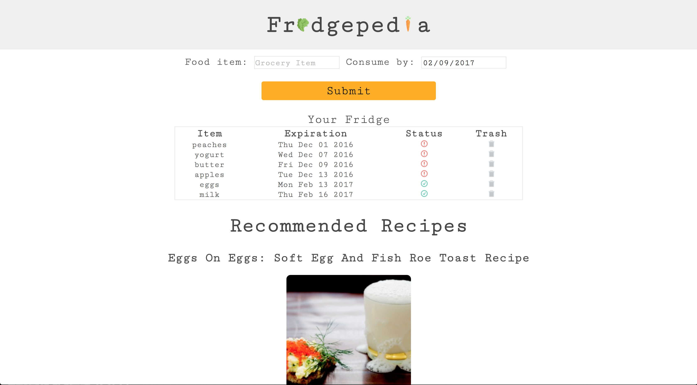

# Fridgepedia #

  
  
  

  Anyone with a refridgerator can use this app to track the expiration dates of their food.

## Summary ##
  Include a feature to recommend recipes based on what you have in the fridge. The app will remind users when their food is about to expire. They will be able to add and remove items from their fridge.

## Problem ##
  Solves the problem of forgetting what you have in your fridge and wasting food.

## Solution ##
  User gets recommended recipes to remind the user to consume their food before it spoils

  Best thing since sliced bread, unless you're gluten intolerant.

## How to Get Started ##
  Simply create an account and input your groceries into the app and set a consume by date.

## Customer Quote ##
  "This website is so helpful. Now I dont have to worry about food poisoning!"

## Closing and Call to Action ##
  Try it out for yourself.
